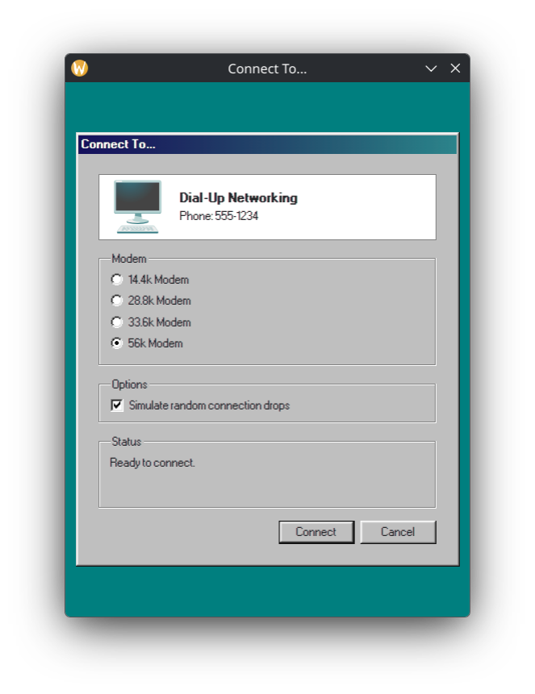
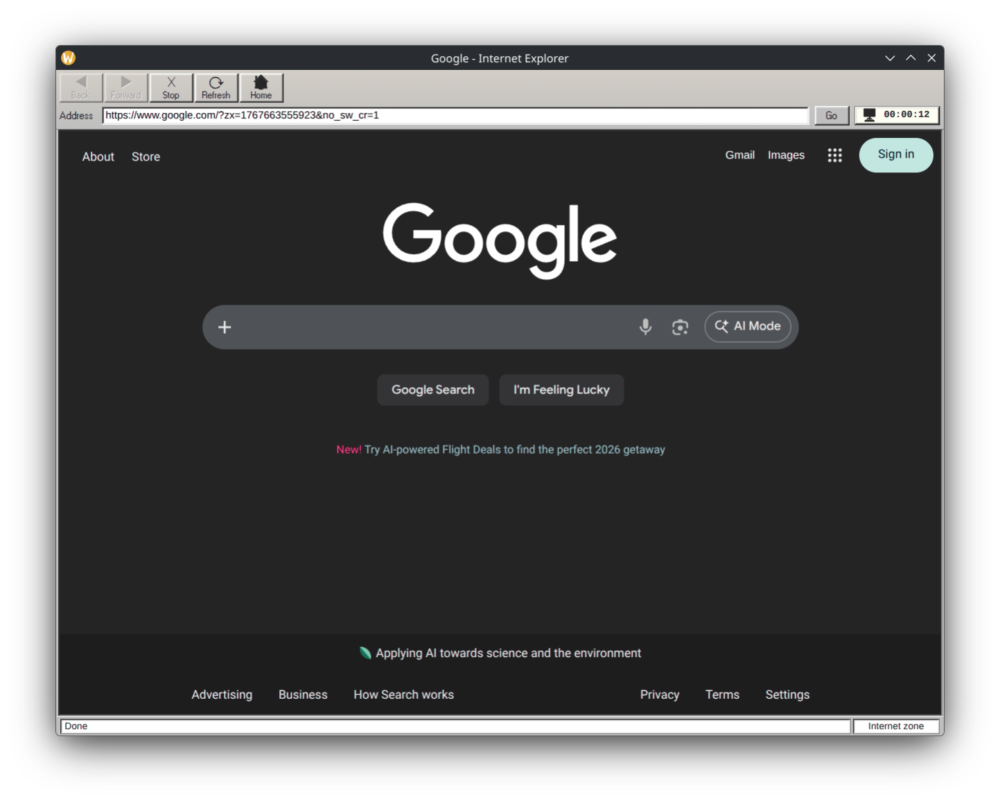

# Retro Browser

A nostalgic Electron application that recreates the 90s dial-up internet experience, complete with authentic modem sounds and a Windows 95/98-styled browser interface.




## Features

- **Authentic Dial-up Simulation**: Experience the classic modem handshake sound while "connecting" to the internet
- **Windows 95/98 UI**: Pixel-perfect retro interface using the 98.css library
- **Working Web Browser**: Full-featured browser with navigation controls, address bar, and connection timer
- **Random Disconnections**: Just like the old days, your connection may randomly drop after 2-3 minutes
- **Sound Effects**: Click sounds for buttons and error sounds for failed actions
- **Connection Status**: Track your connection time in the browser toolbar

## Screenshots

| Dial-up Window | Browser Window |
|----------------|----------------|
|  |  |

## Prerequisites

- [Node.js](https://nodejs.org/) (v18 or higher recommended)
- npm (comes with Node.js)

## Installation

```bash
# Clone the repository
git clone https://github.com/example/retro-browser.git
cd retro-browser

# Install dependencies
npm install
```

## Running the Application

```bash
# Build and start the application
npm start
```

For development with auto-reload on TypeScript changes:

```bash
# In one terminal, watch for TypeScript changes
npm run watch

# In another terminal, run Electron (after initial build)
npx electron .
```

## Building Distributable Packages

```bash
# Build for current platform
npm run dist

# Platform-specific builds
npm run dist:win      # Windows
npm run dist:mac      # macOS
npm run dist:linux    # Linux
```

Built packages will be output to the `release/` directory.

## Project Structure

```
retro-browser/
├── src/
│   ├── main/           # Main Electron process
│   │   ├── main.ts     # Application entry point
│   │   ├── windows.ts  # Window creation and management
│   │   ├── ipc-handlers.ts  # IPC communication handlers
│   │   └── state.ts    # Application state management
│   ├── renderer/       # Renderer processes (UI)
│   │   ├── dialup/     # Dial-up connection window
│   │   ├── browser/    # Browser window
│   │   ├── utils/      # Shared utilities (sounds)
│   │   └── preload.ts  # Context bridge for IPC
│   └── assets/         # Static assets (sounds, icons)
├── scripts/            # Build scripts
└── dist/               # Compiled output (generated)
```

## How It Works

1. **Launch**: The application starts with a dial-up connection dialog
2. **Connect**: Click "Connect" to initiate the dial-up sequence with authentic modem sounds
3. **Browse**: Once connected, a retro Internet Explorer-style browser opens
4. **Disconnect**: Your connection may randomly drop, or you can manually disconnect from the status indicator

## Technologies

- **[Electron](https://www.electronjs.org/)** - Cross-platform desktop application framework
- **[TypeScript](https://www.typescriptlang.org/)** - Type-safe JavaScript
- **[98.css](https://jdan.github.io/98.css/)** - Windows 98 CSS library

## License

MIT
